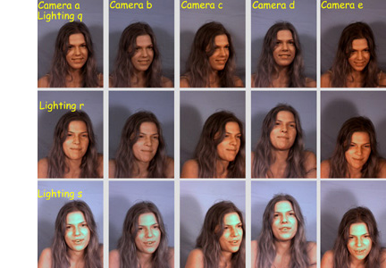
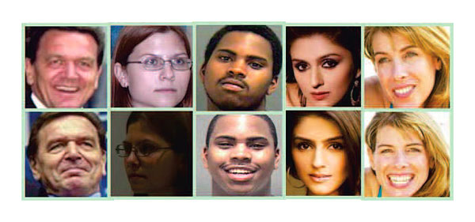
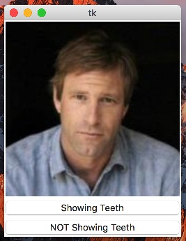
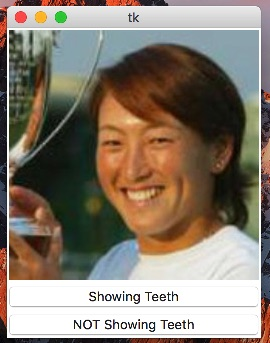
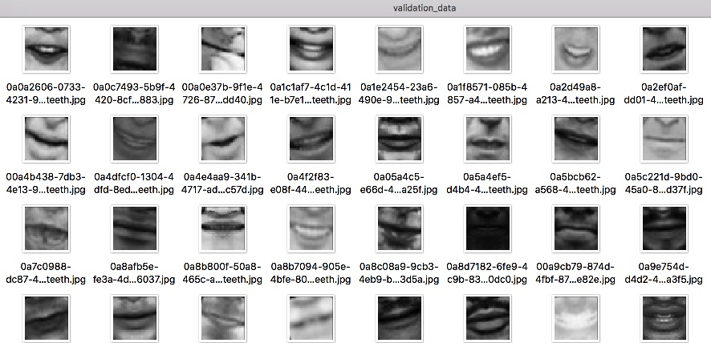

In this blog post, you will learn how to create a complete machine learning pipeline that solves the problem of telling whether or not a person in a picture is showing the teeth, we will see the main challenges that this problem imposes and will tackle some common machine learning problems.
By using a combination of OpenCV computer vision libraries for face detection along with our own convolutional neural network for teeth recognition we will create a very capable system that could handle unseen data withouth loosing significative performance. For quick prototyping we are going to use the Caffe Deep learning framework, but you can use other cool frameworks like TensorFlow or Keras.

Our trained convolutional neural network detecting teeth on real video!

{: .center}

*Obama teeth being detected by our conv net!*

The overall steps that will involve creating the detector pipeline are:
1. Finding the correct datasets, and adpating those datasets to the problem
    2. Labeling the data accordingly ( 1 for showing teeth, 0 not showing teeth)
    3. Detecting the face region in an image
    4. Detecting the principal landmarks on the face
    5. Transforming the face with the detected landmarks to have a "frontal face" transformation
    6. Slicing the relevant parts of the image
    6. Easing the data for training
7. Augmenting the data
8. Setting up the convolutional neural network in Caffe
9. Training and debugging the overall system
10. Testing the model with unseen data

# Finding a dataset
## Muct database
We are going to choose an open dataset called MUCT database http://www.milbo.org/muct/, this dataset contains 3755 faces total all unlabeled, all the images were taken on the same studio with same background but with different lighting also the people on the dataset have different expressions so we have some good variety here.

{: .center}

*Muct database image variations, source http://www.milbo.org/muct/*

Because of manual labeling constrains only a subset of this dataset called muct-a-jpg-v1.tar.gz will be used, this file contains 751 faces and although this is a small number for training the machine learning model, it is possible to obtain good results using data augmentation combined with a powerfull convolutional network, the reason of choosing this limited subset of data is because at some point in the process is necessary to do manual labeling of each picture, but it is always encouraged to label more data to obtain better results.

## LFW database
To have more variety on the data we are going to use the Labeled Faces in the Wild database too http://vis-www.cs.umass.edu/lfw/, this dataset contains 13.233 images of faces total all unlabeled, this database has a lot more variety because it contains faces of people from the web. As same as before we are not going to use the entire dataset but for this case only 1505 faces.




# Labeling the data

Labeling the data is a manual and cumbersome process but necessary, in this problem we have to label images from the two face databases, for this particular case we need to label all the faces with the value: 1 if the face is showing the teeth or 0 otherwise, the label will be stored on the filename of the image for practical pourpuses. 

To recap:
For the MUCT database we are going to label 751 faces.
For the LFW database we are going to label 1505 faces.
So we have a total of 2256 unique faces with different expressions.

Manual labeling can be a tedious process so you can use this simple tool for labeling images quickly using hotkeys, if you push the Y key on your keyboard it will add to the existing filename the label _showingteeth, if you want to use this tool for your purposes feel free to pull it from git hub and modify it to suite your needs. 

https://github.com/juanzdev/ImageBinaryLabellingTool

 
 
 

Note:
Note that this labeled data is not our training set yet, because we have such small data set we need to get rid of unnecessary noise in the images by detecting the face region using some face detection techniques.

# Detecting the face region

## Face detection
There are different techniques for doing face detection, the most well known and accesibles are Haar Cascades and Histogram of Gradients (HOG), OpenCV offers a nice and fast implementation of Haar Cascades and Dlib offers a more precise but slower face detection algorithm with HOG. After doing some testing with both libraries I found that DLib face detection is much more precise and accurate, the Haar approach gives me a lot of false positives, the problem with Dlib face-detection is that it is slow and using it in real video data can be a pain. At the end of the exercise we ended up using both for different kind of situations.

//face detection in action

Note:
You can also use a convolutional neural network for face detection, in fact, you will get much better results if you do, but for simplicity we are going to stick with these out of the box libraries.

In Python, we are going to create two files, one for OpenCV face detection and one for DLib face detection. These files will receive an input image and will return the area of the face.

OpenCV implementation
```python
    def mouth_detect_single(self,image,isPath):

        if isPath == True:
            img = cv2.imread(image, cv2.IMREAD_UNCHANGED) 
        else:
            img = image
        
        img = histogram_equalization(img)
        gray_img1 = cv2.cvtColor(img, cv2.COLOR_BGR2GRAY) 
        faces = self.face_cascade.detectMultiScale(gray_img1, 1.3, 5)

        for (x,y,w,h) in faces:
            roi_gray = gray_img1[y:y+h, x:x+w]
            eyes = self.eye_cascade.detectMultiScale(roi_gray)
            if(len(eyes)>0):
                p = x 
                q = y
                r = w
                s = h
                face_region = gray_img1[q:q+s, p:p+r]
                face_region_rect = dlib.rectangle(long(q),long(p),long(q+s),long(p+r))
                rectan = dlib.rectangle(long(x),long(y),long(x+w),long(y+h))
                shape = self.md_face(img,rectan)
                p2d = np.asarray([(shape.part(n).x, shape.part(n).y,) for n in range(shape.num_parts)], np.float32)
                rawfront, symfront = self.fronter.frontalization(img,face_region_rect,p2d)
                face_hog_mouth = symfront[165:220, 130:190]
                gray_img = cv2.cvtColor(face_hog_mouth, cv2.COLOR_BGR2GRAY) 
                crop_img_resized = cv2.resize(gray_img, (IMAGE_WIDTH, IMAGE_HEIGHT), interpolation = cv2.INTER_CUBIC)
                #cv2.imwrite("../img/output_test_img/mouthdetectsingle_crop_rezized.jpg",gray_img)
                return crop_img_resized,rectan.left(),rectan.top(),rectan.right(),rectan.bottom()
        else:
            return None,-1,-1,-1,-1
```

DLIB Implementation using histogram of gradients
```python
    def mouth_detect_single(self,image,isPath):

        if isPath == True:
            img = cv2.imread(image, cv2.IMREAD_UNCHANGED) 
        else:
            img = image
    
        img = histogram_equalization(img)
        facedets = self.face_det(img,1) #Histogram of gradients
        if len(facedets) > 0:
            facedet_obj= facedets[0]
            shape = self.md_face(img,facedet_obj)
            p2d = np.asarray([(shape.part(n).x, shape.part(n).y,) for n in range(shape.num_parts)], np.float32)
            rawfront, symfront = self.fronter.frontalization(img,facedet_obj,p2d)
            face_hog_mouth = symfront[165:220, 130:190] #get half-bottom part
            if(face_hog_mouth is not None):
                gray_img = cv2.cvtColor(face_hog_mouth, cv2.COLOR_BGR2GRAY) 
                crop_img_resized = cv2.resize(gray_img, (IMAGE_WIDTH, IMAGE_HEIGHT), interpolation = cv2.INTER_CUBIC)
                #cv2.imwrite("../img/output_test_img/mouthdetectsingle_crop_rezized.jpg",crop_img_resized)
                return crop_img_resized,facedet_obj.left(),facedet_obj.top(),facedet_obj.right(),facedet_obj.bottom()
            else:
                return None,-1,-1,-1,-1
        else:
            return None,-1,-1,-1,-1
```
# Landmark detection and frontalization
A common problem in computer vision is the variety of transformations the images can have, they can be rotated at certain degree or they can have different perspectives. 

The next step after face detection is to extract the face landmarks, landmarks are special points in the face that relate to specific relevant parts like the jaw, nose, mouth and eyes, with the detected face and the landmark points it is possible to warp the face image to have a frontal version of it, luckily for us landmark extraction and frontalization can be simplified a lot by using the some dlib libraries.

```python
#landmark detector
shape = self.md_face(img,facedet_obj)
```

md_face receives the face region and will detect 68 landmark points using a previously trained model, with the landmark data we can make a warp transformation to the face using the landmarks as a guide to have the face image facing front.

//image of landmarks with sample face


to warp the face using the landmark data we use a python ported code that use the frontalization techinque by http://www.openu.ac.il/home/hassner/projects/frontalize/ ported by Heng Yang, the complete code can be found at the end of this post:

```python
p2d = np.asarray([(shape.part(n).x, shape.part(n).y,) for n in range(shape.num_parts)], np.float32)
rawfront, symfront = self.fronter.frontalization(img,facedet_obj,p2d)
```

//image of face affined


# Image slicing
Now that we have complete frontal faces we can focus on the mouth region only:

```python
rawfront, symfront = self.fronter.frontalization(img,facedet_obj,p2d)
face_hog_mouth = symfront[165:220, 130:190] #get half-bottom part
```

//image of mouths parts


//picture of a bunch of mouths


With those transformations in place we can assure that our net will recive inputs of the same part of the face everytime without any additional noise improving our precision on the final model, the output of this step will be our true training data, finally!


# Histogram Equalization
A usefull technique for highlighting the details on the image is to apply histogram equalization:

```python
def histogram_equalization(img):
    img[:, :, 0] = cv2.equalizeHist(img[:, :, 0])
    img[:, :, 1] = cv2.equalizeHist(img[:, :, 1])
    img[:, :, 2] = cv2.equalizeHist(img[:, :, 2])
    return img
```

# Data Augmentation
As you recall, we have labeled only 751 images from the MUCT database and 1505 from the LFW database, this is just not enought data for learning to detect teeths, we need to gather more data somehow, the obvious solution is to manual label a couple of thousands images in addition and this is the PREFERED solution, having more data is always better, but it is expensive in time, so for simplicity we are going to augment the data, augmenting the data is a pretty common technique in machine learning and a pretty usefull one. Specifically we are going to make the following transformations to our current training data to get almost 10x times more data (23528 mouth images):

## Mirroring the mouths
For each image we are going to create a mirrored clone, this will give us 2x the data.
//example of mirroring with a muct image

## Rotating the mouths
For each mouth in the training set we are going to make small rotations, specifically -30,-20,-10,+10,+20,+30 degrees, this will give us 6x times the data aprox.


```python
for in_idx, img_path in enumerate(input_data_set):
    file_name = os.path.splitext(os.path.basename(img_path))[0]
    print(file_name)
    augmentation_number = 8
    initial_rot = -20
    #save original too
    path = output_folder+"/"+file_name+".jpg"
    copyfile(img_path, path)
    for x in range(1, augmentation_number):
        rotation_coeficient = x
        rotation_step=5
        total_rotation=initial_rot+rotation_step*rotation_coeficient
        #print(total_rotation)
        mouth_rotated = image_rotated_cropped(img_path,total_rotation)
        #resize to 50 by 50
        mouth_rotated = cv2.resize(mouth_rotated, (IMAGE_WIDTH, IMAGE_HEIGHT), interpolation = cv2.INTER_CUBIC)
        if generate_random_filename == 1:
            guid = uuid.uuid4()
            uid_str = guid.urn
            str_guid = uid_str[9:]
            path = ""
            if 'showingteeth' in img_path:
                path = output_folder+"/"+str_guid+"_showingteeth.jpg"
            else:
                path = output_folder+"/"+str_guid+".jpg"
            cv2.imwrite(path,mouth_rotated)
        else:
            path = ""
            if 'showingteeth' in img_path:
                path = output_folder+"/"+file_name+"_rotated"+str(x)+"_showingteeth.jpg"
            else:
                path = output_folder+"/"+file_name+"_rotated"+str(x)+".jpg"
            cv2.imwrite(path,mouth_rotated)

```

# Seting up the Convolutional neural network in Caffe
The folling steps are requried to correctly configure a convolutional neural network in caffe:

## Preparing the training set and validation set
Now that we have enough labeled mouths in place, we need to split it into two subsets, we are going to use the 80/20 rule, 80 percent (18828 mouth images) of our transformed data are going to be the in training set and the rest of the 20 percent (4700 mouth images) are going to be in the validation set. The training data will be used during the training phase for our network learning and the validation set will be used to test the performance of the net during training, in this case, we have to move the mouth images to their respective folders located in training_data and validation_data.

training set folder


validation set folder


## Creating the LMDB file

With the mouth images located in the training and validation folders, we are going to generate two text files, each containing the path of the corresponding mouth images plus the label (1 or 0), these text files are needed because Caffe has a tool to generate LMDB files based on these plain text files.

```python
import caffe
import lmdb
import glob
import cv2
import uuid
from caffe.proto import caffe_pb2
import numpy as np
import os


train_lmdb = "../train_lmdb"
train_data = [img for img in glob.glob("../img/training_data/*jpg")]
val_data = [img for img in glob.glob("../img/validation_data/*jpg")]

myFile = open('../training_data.txt', 'w')

for in_idx, img_path in enumerate(train_data):
    head, tail = os.path.split(img_path)
    label = -1
    if 'showingteeth' in tail:
        label = 1
    else:
        label =0
    myFile.write(tail+" "+str(label)+"\n")

myFile.close()


f = open('../training_val_data.txt', 'w')

for in_idx, img_path in enumerate(val_data):
    head, tail = os.path.split(img_path)
    label = -1
    if 'showingteeth' in tail:
        label = 1
    else:
        label =0
    f.write(tail+" "+str(label)+"\n")

f.close()

```


To generate both training and validation LMDB files we run the following commands:

```bash
convert_imageset --gray --shuffle /devuser/Teeth/img/training_data/ training_data.txt train_lmdb
convert_imageset --gray --shuffle /devuser/Teeth/img/validation_data/ training_val_data.txt val_lmdb
```

## Extracting the mean data for the entire dataset
A common step in computer vision is to extract the mean data of the entire training dataset to facilitate the learning process during backpropagation, Caffe already has a library to calculate the mean data for us:

```bash
compute_image_mean -backend=lmdb train_lmdb mean.binaryproto
```

This will generate a file called mean.binaryproto, this file will have matrix data related to the overall mean of our training set, this will be subtracted during training to each and every one of our training examples to have a more reasonable scale for the inputs.

## Designing and implementing the convolutional neural network

Convnets are really good at image recognition because they can learn features automatically just by providing input and output data, they are also very good at transformation invariances this is small changes in rotation and full changes in translation.
In machine learning there are a set of well-known state-of-the-art architectures for image processing like AlexNet, VGGNet, Google Inception etc. If you follow that kind of architectures is almost guaranteed you will obtain the best results possible, for this case and for the sake of simplicity we are going to use a simplified version of these nets with much less convolutional layers, remember that in this particular case we are just trying to extract teeth features from the mouths and not entire concepts of the real world like AlexNet does, so a net with much less capacity will do fine for the task.

train_val_feature_scaled.prototxt
```json
name: "TeethNet"
layer {
  name: "data"
  type: "Data"
  top: "data"
  top: "label"
  include {
    phase: TRAIN
  }
  transform_param {
    scale: 0.00390625
    mean_file: "mean.binaryproto"
    mirror: false
    
  }
  data_param {
    source: "train_lmdb"
    batch_size: 256
    backend: LMDB
  }
}

layer {
  name: "data"
  type: "Data"
  top: "data"
  top: "label"
  include {
    phase: TEST
  }
  transform_param {
    scale: 0.00390625
    mean_file: "mean.binaryproto"
    mirror: false
  }
  data_param {
    source: "val_lmdb"
    batch_size: 256
    backend: LMDB
  }
}
layer {
  name: "conv1"
  type: "Convolution"
  bottom: "data"
  top: "conv1"
  param {
    lr_mult: 1
  }
  param {
    lr_mult: 2
  }
  convolution_param {
    num_output: 20
    kernel_size: 5
    stride: 1
    weight_filler {
      type: "xavier"
    }
    bias_filler {
      type: "constant"
    }
  }
}
layer {
  name: "pool1"
  type: "Pooling"
  bottom: "conv1"
  top: "pool1"
  pooling_param {
    pool: MAX
    kernel_size: 2
    stride: 2
  }
}
layer {
  name: "conv2"
  type: "Convolution"
  bottom: "pool1"
  top: "conv2"
  param {
    lr_mult: 1
  }
  param {
    lr_mult: 2
  }
  convolution_param {
    num_output: 50
    kernel_size: 5
    stride: 1
    weight_filler {
      type: "xavier"
    }
    bias_filler {
      type: "constant"
    }
  }
}
layer {
  name: "pool2"
  type: "Pooling"
  bottom: "conv2"
  top: "pool2"
  pooling_param {
    pool: MAX
    kernel_size: 2
    stride: 2
  }
}
layer {
  name: "ip1"
  type: "InnerProduct"
  bottom: "pool2"
  top: "ip1"
  param {
    lr_mult: 1
  }
  param {
    lr_mult: 2
  }
  inner_product_param {
    num_output: 500
    weight_filler {
      type: "xavier"
    }
    bias_filler {
      type: "constant"
    }
  }
}
layer {
  name: "relu1"
  type: "ReLU"
  bottom: "ip1"
  top: "ip1"
}

layer {
  name: "drop1"
  type: "Dropout"
  bottom: "ip1"
  top: "ip1"
  dropout_param {
    dropout_ratio: 0.5
  }
}

layer {
  name: "ip2"
  type: "InnerProduct"
  bottom: "ip1"
  top: "ip2"
  param {
    lr_mult: 1
  }
  param {
    lr_mult: 2
  }
  inner_product_param {
    num_output: 2
    weight_filler {
      type: "xavier"
    }
    bias_filler {
      type: "constant"
    }
  }
}
layer {
  name: "loss"
  type: "SoftmaxWithLoss"
  bottom: "ip2"
  bottom: "label"
  top: "loss"
}
layer {
  name: "accuracy"
  type: "Accuracy"
  bottom: "ip2"
  bottom: "label"
  top: "accuracy"
  include {
    phase: TEST
  }
}
```

deploy.prototxt

```json
name: "TeethNet"
layer {
  name: "input"
  type: "Input"
  top: "data"
  input_param {
    shape {
      dim: 1
      dim: 1
      dim: 32
      dim: 32
    }
  }
}
layer {
  name: "conv1"
  type: "Convolution"
  bottom: "data"
  top: "conv1"
  param {
    lr_mult: 1
  }
  param {
    lr_mult: 2
  }
  convolution_param {
    num_output: 20
    kernel_size: 5
    stride: 1
    weight_filler {
      type: "xavier"
    }
    bias_filler {
      type: "constant"
    }
  }
}
layer {
  name: "pool1"
  type: "Pooling"
  bottom: "conv1"
  top: "pool1"
  pooling_param {
    pool: MAX
    kernel_size: 2
    stride: 2
  }
}
layer {
  name: "conv2"
  type: "Convolution"
  bottom: "pool1"
  top: "conv2"
  param {
    lr_mult: 1
  }
  param {
    lr_mult: 2
  }
  convolution_param {
    num_output: 50
    kernel_size: 5
    stride: 1
    weight_filler {
      type: "xavier"
    }
    bias_filler {
      type: "constant"
    }
  }
}
layer {
  name: "pool2"
  type: "Pooling"
  bottom: "conv2"
  top: "pool2"
  pooling_param {
    pool: MAX
    kernel_size: 2
    stride: 2
  }
}
layer {
  name: "ip1"
  type: "InnerProduct"
  bottom: "pool2"
  top: "ip1"
  param {
    lr_mult: 1
  }
  param {
    lr_mult: 2
  }
  inner_product_param {
    num_output: 500
    weight_filler {
      type: "xavier"
    }
    bias_filler {
      type: "constant"
    }
  }
}
layer {
  name: "relu1"
  type: "ReLU"
  bottom: "ip1"
  top: "ip1"
}
layer {
  name: "drop1"
  type: "Dropout"
  bottom: "ip1"
  top: "ip1"
  dropout_param {
    dropout_ratio: 0.5
  }
}
layer {
  name: "ip2"
  type: "InnerProduct"
  bottom: "ip1"
  top: "ip2"
  param {
    lr_mult: 1
  }
  param {
    lr_mult: 2
  }
  inner_product_param {
    num_output: 2
    weight_filler {
      type: "xavier"
    }
    bias_filler {
      type: "constant"
    }
  }
}
layer {
  name: "softmax"
  type: "Softmax"
  bottom: "ip2"
  top: "pred"
}

```

solver.prototxt
```json
net: "model/train_val_feature_scaled.prototxt"
test_iter: 5
test_interval: 100
base_lr: 0.1
lr_policy: "step"
gamma: 0.1
stepsize: 500
display: 10
max_iter: 10000
momentum: 0.9
weight_decay: 0.0005
snapshot: 100
snapshot_prefix: "model_snapshot/snap_fe"
solver_mode: CPU
```

CNN Architecture


# Training and debugging the overall system

## Training the neural network
With the architecture in place we are ready to start learning the model, we are going to execute the caffe train command to start the training process, note that all the data from the LMDB files will flow throuhg the data layer of the network along with the labels, also the backpropagation learning procedure will take place at the same time, and by using gradient descent optimization the error rate will decrease in each iteration.

```bash
caffe train --solver=model/solver_feature_scaled.prototxt 2>&1 | tee logteeth_ult_fe_2.log
```

## Plotting loss vs iterations 
A good way to measure the performance of the learning in our convolutional neural network is to plot the loss on the training and validation set vs the number of iterations.

Note:
To create the plot is necessary to pre-process the .log file generated on the training phase, to do this execute:

```bash
python /Users/juank/Dev/caffe/tools/extra/parse_log.py logteeth.log .
```
this command will generate two-plain text files containg all the metrics for the validation set vs iterations and the training set vs iterations.
The next step is to plot the data using the provided Caffe tool for plotting:

```bash
python plot_diag.py 
```


Training with learning rate 0.01

Note:
It looks like we are stuck in a local minima!, you can tell this just by looking at this usefull graph, note that the validation error wont go down it looks like the best it can do is 30% error on the validation set!, now a usefull technique is to start with a bigger learning rate and then start decreasing it after a few iterations, lets try with learning rate 0.1


Training with learning rate 0.1

Training with learning rate 0.1 (much better!)
Look how we overcome the local minima at the beginning then we found a much deeper region on the loss space just by incrementing the initial learning rate at the begining, be carefull because this doesnt always works and is problem dependant.

## Deploying the trained convnet
Now that we have our network trained and it seems to have a good performance on the validation set it is time to start using it with unseen data.
To do this we are going to use the caffe library for python, and we are going to create a simple python script that will load the deploy architecture of our convnet, and along with this architecture we are going to feed it with the trained weights located on the .caffemodel file.

```python
#extract mean data
mean_blob = caffe_pb2.BlobProto()
with open('../mean.binaryproto') as f:
    mean_blob.ParseFromString(f.read())

mean_array = np.asarray(mean_blob.data, dtype=np.float32).reshape(
    (mean_blob.channels, mean_blob.height, mean_blob.width))

mean_array = mean_array*0.003921568627

net = caffe.Net('../model/deploy.prototxt',1,weights='../model_snapshot/snap_fe_iter_8700.caffemodel')
net.blobs['data'].reshape(1,1, IMAGE_WIDTH, IMAGE_HEIGHT)
transformer = caffe.io.Transformer({'data': net.blobs['data'].data.shape})
transformer.set_mean('data', mean_array)
transformer.set_transpose('data', (2,0,1))
transformer.set_raw_scale('data', 0.00392156862745) 


if BULK_PREDICTION==0:
	img = cv2.imread(individual_test_image, cv2.IMREAD_UNCHANGED)
	mouth_pre = mouth_detector_instance.mouth_detect_single(individual_test_image,True)
	if mouth_pre is not None:
		mouth_pre = mouth_pre[:,:,np.newaxis]
		mouth = transformer.preprocess('data', mouth_pre)
		net.blobs['data'].data[...] = mouth
		out = net.forward()
		pred = out['pred'].argmax()
		print(individual_test_image)
		print("Prediction:")
		print(pred)
		print("Prediction probabilities")
		print(out['pred'])
else:
	files = glob.glob(test_output_result_folder_path+'/not_showing_teeth/*')
	for f in files:
		os.remove(f)

	files = glob.glob(test_output_result_folder_path+'/showing_teeth/*')
	for f in files:
		os.remove(f)
	
	#performance variables
	total_samples = 0
	total_positives_training = 0
	total_negatives_training = 0
	true_positive = 0
	true_negative = 0
	false_positive = 0
	false_negative = 0
	
	for in_idx, img_path in enumerate(original_data_set):
		total_samples = total_samples + 1
		head, tail = os.path.split(img_path)
		img = cv2.imread(img_path, cv2.IMREAD_UNCHANGED)
		img = transform_img(img, img_width=IMAGE_WIDTH_MAIN, img_height=IMAGE_HEIGHT_MAIN)
		mouth_pre = mouth_detector_instance.mouth_detect_single(img_path,True)
		if mouth_pre is not None:
			mouth_pre = mouth_pre[:,:,np.newaxis]
			mouth = transformer.preprocess('data', mouth_pre)
			net.blobs['data'].data[...] = mouth
			out = net.forward()
			pred = out['pred'].argmax()
			print("Prediction:")
			print(pred)
			print("Prediction probabilities")
			print(out['pred'])
			if(pred==1):
				if 'showingteeth' in tail:
					total_positives_training = total_positives_training + 1
					true_positive = true_positive + 1
				else:
					total_negatives_training = total_negatives_training + 1
					false_positive = false_positive + 1

				path = test_output_result_folder_path+"/showing_teeth/"+tail
				shutil.copy2(img_path, path)
			else:
				if 'showingteeth' in tail:
					total_positives_training = total_positives_training + 1
					false_negative = false_negative + 1
				else:
					total_negatives_training = total_negatives_training + 1
					true_negative = true_negative + 1

				path = test_output_result_folder_path+"/not_showing_teeth/"+tail
				shutil.copy2(img_path, path)

	print "Total samples %d" %total_samples
 	print "True positives %d" %true_positive
 	print "False positives %d" %false_positive
	print "True negative %d" %true_negative
	print "False negative %d" %false_negative
	
	accuracy = (true_negative + true_positive)/total_samples
	recall = true_positive / (true_positive + false_negative)
	precision = true_positive / (true_positive + false_positive)
	f1score = 2*((precision*recall)/(precision+recall))

	print "Accuracy  %.2f" %accuracy
	print "Recall  %.2f" %recall
	print "Precision  %.2f" %precision
	print "F1Score  %.2f" %f1score
```
Note:
Note that this script will test our trained net passing it a new single image if the parameter BULK_PREDICTION is set to zero, otherwise it will make a bulk prediction over an entire folder of images and will move the ones he thinks are showing the teeth to the corresponding folder.

## Testing the trained model with unseen data

## Testing for a single image

First I'm going to test the net with some individual unseen images to see individual results, to do this please modify the parameters shown below:

```python
BULK_PREDICTION = 0 #Set this to 0 to classify individual files
#if BULK_PREDICTION = 0 the net will classify only the file specified on individual_test_image
individual_test_image = "../test_image.jpg"
```
Testing an individual images results:


//image of samples images and probabilities also show some errors

## Testing for a bunch of images (Bulk testing)

Now I'm going to test over an entire folder of unseen images, in this case, we have to modify the parameters shown below:

```python
BULK_PREDICTION = 1 #Set this to 0 to classify individual files
#if bulk prediction is set to 1 the net will predict all images on the configured path
test_set_folder_path = "../img/original_data/b_labeled"
#all the files will be moved to a showing teeth or not showing teeth folder on the test_output_result_folder_path path
test_output_result_folder_path = "../result"
```

the folder called b_labeled have images taken on different angles of the sampled MUCT dataset so, also note that I previously label this images manually just to know how good or how bad the net is behaving by calculating a bunch of important metrics.

You can look back at the entire script to know how the following code segment relate to the code, basically we are calculating the F1score to know how good or bad our model is doing.

```python
accuracy = (true_negative + true_positive)/total_samples
recall = true_positive / (true_positive + false_negative)
precision = true_positive / (true_positive + false_positive)
f1score = 2*((precision*recall)/(precision+recall))
```

So to run the script to start testing the net by classifying the b_labeled folder, execute:

```bash
python predict_feature_scaled.py
```

Note that this script will read all the images specified on the input folder and will pass one by one each image to our convolutional neural network and depending on the prediction probabilities it will copy the image to the showing_teeth or not_showing_teeth folder.
At the end of the execution the accuracy,preccision,recall and f1score will be calculated:

|                | Predicted Negative | Predicted Positive |
|----------------|--------------------|--------------------|
| Negative Cases | TN: 283            | FP: 18             |
| Positive Cases | FN: 54             | TP: 396            |

Total samples 751
True positives 396
False positives 18
True negative 283
False negative 54
Accuracy  0.90
Recall  0.88
Precision  0.96
F1Score  0.92

The model looks good.

By looking at the performance metrics we can start experimenting with different hyper-parameters or different modifications to our pipeline and always have a point of comparission to see if we are doing better or not.

## Testing our net with real video!
Now lets have some fun by passing a fragment of the Obama presidential speech to the trained net to see if Obama is showing his teeth to the camera or not, note that  in each frame of a video the net needs to make a prediction, this prediction will be rendered resulting video along with the HOG face detection boundary.

```python
import numpy as np
import sys
import caffe
import glob
import uuid
import cv2
from util import transform_img
from mouth_detector_dlib import mouth_detector
from caffe.proto import caffe_pb2
import os
import shutil
from util import histogram_equalization


IMAGE_WIDTH = 32
IMAGE_HEIGHT = 32

def predict(image,mouth_detector):
	img = image
	mouth_pre,x,y,w,h = mouth_detector.mouth_detect_single(img,False)

	if mouth_pre is not None:
		mouth_pre = mouth_pre[:,:,np.newaxis]
		mouth = transformer.preprocess('data', mouth_pre)
		net.blobs['data'].data[...] = mouth
		out = net.forward()
		print("Prediction probabilities")
		print(out['pred'])
		if(out['pred'][0][1]>0.70):
			return 1,out['pred'],x,y,w,h
		else:
			return 0,out['pred'],x,y,w,h
	else:
		return -1,0,0,0,0,0

#CNN Definition
#extract mean data
mean_blob = caffe_pb2.BlobProto()
with open('../mean.binaryproto') as f:
    mean_blob.ParseFromString(f.read())

mean_array = np.asarray(mean_blob.data, dtype=np.float32).reshape(
    (mean_blob.channels, mean_blob.height, mean_blob.width))

mean_array = mean_array*0.003921568627

net = caffe.Net('../model/deploy.prototxt',1,weights='../model_snapshot/snap_fe_iter_8700.caffemodel')
net.blobs['data'].reshape(1,1, IMAGE_WIDTH, IMAGE_HEIGHT) 
transformer = caffe.io.Transformer({'data': net.blobs['data'].data.shape})
transformer.set_mean('data', mean_array)
transformer.set_transpose('data', (2,0,1))
transformer.set_raw_scale('data', 0.00392156862745) 


size = cv2.getTextSize("Showing teeth", cv2.FONT_HERSHEY_PLAIN, 2, 1)[0]
x,y = (50,250)
label_top_left = (x - size[0]/2, y - size[1]/2)
mouth_detector_instance = mouth_detector()


# Define the codec and create VideoWriter object
fourcc = cv2.cv.CV_FOURCC(*'mp4v')
cap = cv2.VideoCapture('../obama-speech.mp4')
cap.set(1,10000); # Where frame_no is the frame you want
ret, frame = cap.read() # Read the frame
#cv2.imshow('window_name', frame) # show frame on window
w = cap.get(cv2.cv.CV_CAP_PROP_FRAME_WIDTH);
h = cap.get(cv2.cv.CV_CAP_PROP_FRAME_HEIGHT);
out = cv2.VideoWriter('output.avi',fourcc, 24, (int(w),int(h)))
#cap.set(3,500)
#cap.set(4,500)
#cap.set(5,30)

ret, frame = cap.read()
while(cap.isOpened()):
	ret, frame = cap.read()
	copy_frame = frame.copy()
	
	result,prob,xf,yf,wf,hf = predict(copy_frame,mouth_detector_instance)

	if result is not None:
	    if(result == 1):
	    	cv2.rectangle(frame, (xf,yf),(wf,hf),(0,255,0),4,0)
	    	prob_round = prob[0][1]*100
	    	print prob_round
	    	cv2.rectangle(frame, (xf-2,yf-25),(wf+2,yf),(0,255,0),-1,0)
	    	cv2.rectangle(frame, (xf-2,hf),(xf+((wf-xf)/2),hf+25),(0,255,0),-1,0)
	    	cv2.putText(frame, "Teeth!!",(xf,hf+14),cv2.FONT_HERSHEY_PLAIN,1.2,0,2)
	    	cv2.putText(frame, str(prob_round)+"%",(xf,yf-10),cv2.FONT_HERSHEY_PLAIN,1.2,0,2)
	    	print "SHOWING TEETH!!!"
	    elif(result==0):
	    	cv2.rectangle(frame, (xf,yf),(wf,hf),(64,64,64),4,0)
	    	prob_round = prob[0][1]*100
	    	print prob_round
	    	cv2.rectangle(frame, (xf-2,yf-25),(wf+2,yf),(64,64,64),-1,0)
	    	cv2.rectangle(frame, (xf-2,hf),(xf+((wf-xf)/2),hf+25),(64,64,64),-1,0)
	    	cv2.putText(frame, "Teeth??",(xf,hf+14),cv2.FONT_HERSHEY_PLAIN,1.2,0,2)
	    	cv2.putText(frame, str(prob_round)+"%",(xf,yf-10),cv2.FONT_HERSHEY_PLAIN,1.2,0,2)
	
	out.write(frame)
	cv2.imshow('frame',frame)
	
	if cv2.waitKey(200) & 0xFF == ord('q'):
		break

cap.release()
out.release()
cv2.destroyAllWindows()

```
By running the script above you can test the net with the video you desire, in this particular case I'm testing it with the Obama speech.


