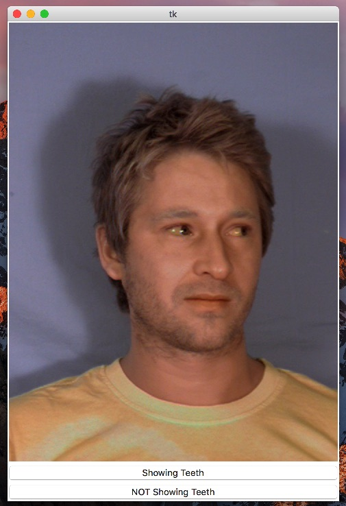
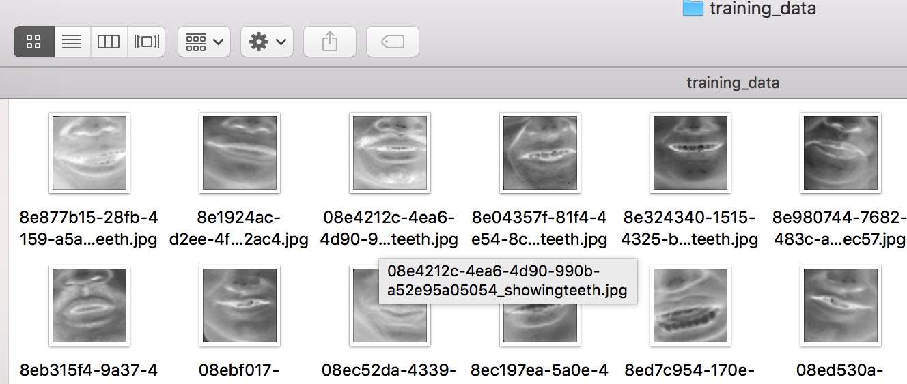
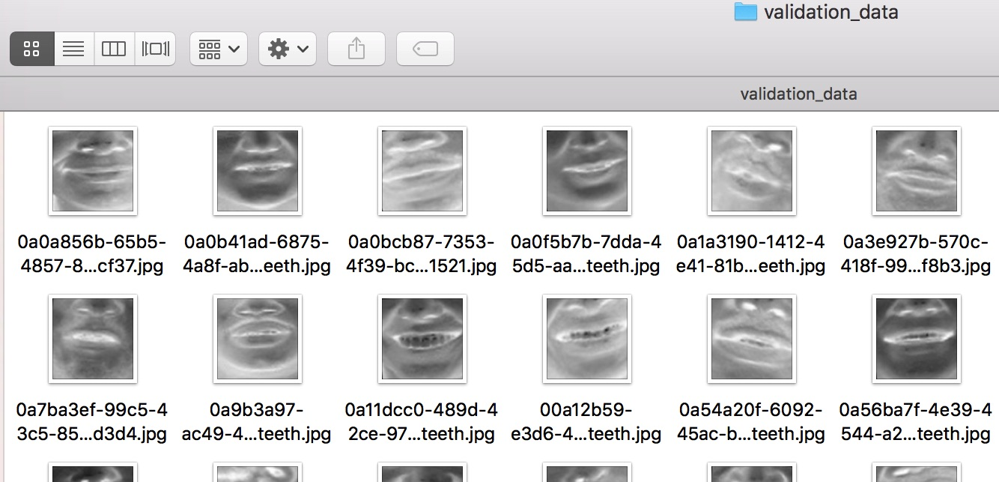
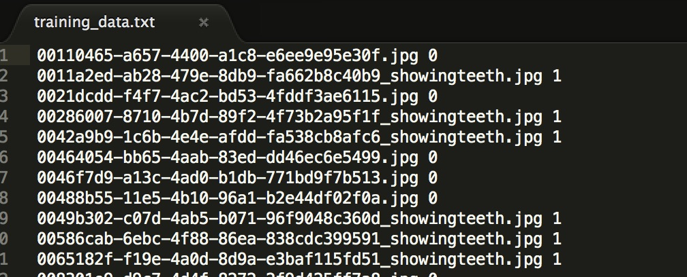

In this blog post, I'm going to explain how you can create a complete machine learning pipeline that solves the problem of telling whether or not a person is showing is teeth, I will show the main challenges that I faced implementing this task. Specifically, I'm going to use a combination of OpenCV computer vision models for face detection with a convolutional neural network for teeth recognition. For quick prototyping, I'm going to use the Caffe Deep learning framework, but you can use other cool frameworks like TensorFlow or Keras.

Main challenges:
1. Finding datasets where people are showing their teeth or not, and adpating those datasets to the problem
    2. Label the data accordingly ( 1 for showing teeth, 0 not showing teeth)
    3. Detect the face region in an image
    4. Detect the principal landmarks on the face
    5. Transform the face with the detected landmarks to have a "frontal face"
    6. Highlight the teeth on the face
7. Augment data for posterior training
8. Setting up the Convolutional neural network in Caffe
9. Training and debugging the system
10.Testing the model

#Finding a dataset
# Muct database
There are a lot of datasets with faces on the web, I choose an open dataset called MUCT database http://www.milbo.org/muct/, this dataset contains 3755 faces with landmarks, for the purpose of this post I'm not going to use the landmark data.

 

This dataset has a lot of variation in lighting, people face types and expressions. I only used one part of this dataset called muct-a-jpg-v1.tar.gz, this file contains 700+ faces, although this is a small number for training the machine learning model, it is possible to obtain good results using data augmentation combined with a good convolutional net model, the reason I choose only this limited subset of data is because at some point in the process is necessary to do manual labeling of the data and this tasks takes time, but you can label more and more data to obtain better results.

# LFW database
I also use the Labeled Faces in the Wild database for faces data http://vis-www.cs.umass.edu/lfw/, this data set contains 13.000 images of faces, this face database has more variety because it is taken directly from the web, so this information will be very valuable in our training.


//picture of face of LFW database

#Labeling the data

Labeling the data is a manual process and it can be cumbersome to do although is necessary to do it only once, in this problem we have to label images from the two face databases, for this particular case we need to label all the faces with the value 1 if the face is showing the teeth or 0 otherwise, the label will be stored on the filename of the image for practical pourpuses. 

For the MUCT database we are going to label 700 faces.
For the LFW database we are going to label 1500 faces.


Manual labeling can be a tedious process so I created a simple tool for labeling images, if you push the button yes it will add to the existing filename the label _true or _false otherwise, if you want to use this tool for your purposes feel free to pull it from git hub and modify it to your needs here 

https://github.com/juanzdev/ImageBinaryLabellingTool

 

Also note that this labeled data is not our training set yet, because we have such small data set we have to help the model a little bit, we are going to get rid of unnecessary noise in the images by detecting the face region using a techique called Histogram of Gradients, this will help us to reduce overfitting the data quite a bit.

# Detecting the face region

# Face detection
There are different techniques for face detection, the most well known and accesibles are Haar cascade and Histogram of Gradients (HOG), OpenCV offers a nice and fast implementation of Haar cascades and Dlib offers a more precise but slower face detection algorithm with HOG. After doing some testing with both libraries I found that DLib face-detection is much more precise and accurate, the Haar approach gives me a lot of false positives, the problem with Dlib face-detection is that it is slow and using it in real video data can be a pain. At the end of the exercise we ended up using both for different kind of situations.

//face detection in action

# Landmark detection and frontalization
The next step after face detection is to extract valuable context data of the face using landmark extraction, landmarks are special points in the face that relate to specific parts of the face like the jaw, nose, mouth and eyes, with the detected face and the landmark points it is possible to warp the face image to have a frontal version of it, luckily for us landmark extraction and frontalization can be  simplified a lot by using the some dlib classes.

//landmark detection in action

Note that you can also use a convolutional neural network for face detection, in fact, you will get much better results if you do, but for simplicity, I will stick with OpenCV for simplicity.

In Python, I will create two classes, one for OpenCV face detection and one for DLib face detection. These classes will receive an input image and will return the area of the face.

OpenCV implementation
```python
def mouth_detect_single(image,isPath):

    if isPath == True:
        img = cv2.imread(image, cv2.IMREAD_UNCHANGED) 
    else:
        img = image
    
    face_cascade = cv2.CascadeClassifier('../lib/haarcascade/haarcascade_frontalface_default.xml')
    eye_cascade = cv2.CascadeClassifier('../lib/haarcascade/haarcascade_eye.xml')
    mouth_cascade = cv2.CascadeClassifier('../lib/haarcascade/mouth.xml')
    gray_img = cv2.cvtColor(img, cv2.COLOR_BGR2GRAY) 
    cv2.imwrite("../img/output_test_img/hmouthdetectsingle.jpg",gray_img)
    faces = face_cascade.detectMultiScale(gray_img, 1.3, 5)

    for (x,y,w,h) in faces:
        #cv2.rectangle(img,(x,y),(x+w,y+h),(255,0,0),2)
        roi_gray = gray_img[y:y+h, x:x+w]
        eyes = eye_cascade.detectMultiScale(roi_gray)

        if(len(eyes)>0):
            #valid face
            height_region = (h + y)-y
            width_region = (w + x) - x 
            p = x + (width_region/4)
            q = y + (height_region/2)
            r = w - (width_region/2)
            s = h - (height_region/2)
            mouth_region = gray_img[q:q+s, p:p+r]
            ##tt=cv2.rectangle(face_gray,(mp,mq),(mp+mr,mq+ms), (255,255,255),2)
            #cv2.imwrite("../img/output_test_img/mouthdetectsingle_crop_region.jpg",gray_img)
            negative_mouth_region = negative_image(mouth_region)
            crop_img = negative_mouth_region
            crop_img_resized = cv2.resize(crop_img, (IMAGE_WIDTH, IMAGE_HEIGHT), interpolation = cv2.INTER_CUBIC)
            cv2.imwrite("../img/output_test_img/mouthdetectsingle_crop_rezized.jpg",crop_img_resized)
            cv2.imwrite("../img/output_test_img/mouthdetectsingle_crop_negative.jpg",negative_mouth_region)
            return crop_img_resized
    else:
        print "NOFACE"
```

DLIB Implementation using histogram of gradients
```python
def mouth_detect_single(image,isPath):
    
    if isPath == True:
        img = cv2.imread(image, cv2.IMREAD_UNCHANGED) 
    else:
        img = image

    gray_img = cv2.cvtColor(img, cv2.COLOR_BGR2GRAY) 
    face_hog_mouth = detect_face(gray_img,False)
    if(face_hog_mouth is not None):
        negative_mouth_region = negative_image(face_hog_mouth)
        crop_img_resized = cv2.resize(negative_mouth_region, (IMAGE_WIDTH, IMAGE_HEIGHT), interpolation = cv2.INTER_CUBIC)
        #cv2.imwrite("../img/output_test_img/mouthdetectsingle_crop_rezized.jpg",crop_img_resized)
        return crop_img_resized

def detect_face(image,isPath):

	if isPath == True:
		img = io.imread(image)
	else:
		img = image
		print(image.shape)

	face_detector = dlib.get_frontal_face_detector()
	detected_faces = face_detector(img, 1)

	if(len(detected_faces)>0):
		face_rect = detected_faces[0]
		i = 1
		bottom = face_rect.bottom()
		top = face_rect.top()
		right = face_rect.right()
		left = face_rect.left()
		print("- Face #{} found at Left: {} Top: {} Right: {} Bottom: {}".format(i, left, top, right, bottom))
		#cv2.rectangle(gray_img,(p,q),(p+r,q+s),(255,0,0),2)
		height_region = (bottom - top)
		width_region = (right - left)
		p = left+ (width_region/4)
		q = top + (height_region/2)
		r = right - (width_region/4)
		s = bottom
		face_region = img[q:s, p:r]
		return face_region
```

Now a typical problem in computer vision is the different transformations our images can have, they can be rotated at certain degree, and that will make difficult for our machine learning model to predict the correct answer, although it is proven that in a convolutional neural network you can have certain degree of flexibility with rotation and translations, this is a nice property of CNNs called invariance to transformations. We are going to have that nice property only for our teeth detector ConvNet but for face detection, we have to make an additional process called landmark detection to overcome this problem.

//code fragment for landmark detector

//image of landmarks with sample face


this function receives the face region and will detect 68 landmark points using a previously trained model this will help us have relevant information about the orientation of the face.
Now we can make a warp transformation to the face using the landmarks as a guide to have the face image facing front.

//code fragment for affine transformation
//image of face affined


Now that we have a standard way to see images our face detection process will be much precise.
The next step is to slice the image horizontally and take only the bottom region this is the mouth region.

Now that we have frontal faces we can focus on the mouth region, a simple region is to divide this image in two and take the bottom region, for sake of simplicity I'm going to use this approach.

//code fragment for image slicing
//image of mouths parts

//picture of a bunch of mouths


#Highlithing the teeth 
Now a quick technique to highlight the teeth on the mouth region is inverting the image pixels, this is converting the image to the negative image, there may be other methods but this particular one worked well for me.

//code for extracting the negative image
//picture of mouth enhanced with negative pattern

//picture of a bunch of negative mouths


This pre-processing step will help a lot our convolutional neural network to learn features easier, but also note that we are doing this because in this particular case we are working with small sets of data, if we had millions of images we could easily feed the entire image to the net and it will learn teeth features for sure.

#Data Augmentation
Because we are working with small sets of data we need to create synthetic data aka data augmentation, for this particular case we are going to do the following transformations for each image in our dataset to get almost 10x times more data.

* Mirroring of mouths
For each image we are going to create a mirrored clone, this will give us 2x the data.
//example of mirroring with a muct image

* Shearing of mouths
For each image we are going to make small rotations, specifically -30,-20,-10,+10,+20,+30 degrees of rotation this will give us 8x the data.
//example of shearing with a muct image

* Scaling of mouths
For each image we are going scale it by small factors, this will give us 2x the data
//example of scaling with a muct image


//rotating the image to create more data
```python
input_folder = "../img/mouth_data"
input_data_set = [img for img in glob.glob(input_folder+"/*jpg")]
output_folder ="../img/all_data"
generate_random_filename = 1

for in_idx, img_path in enumerate(input_data_set):
    file_name = os.path.splitext(os.path.basename(img_path))[0]
    print(file_name)
    augmentation_number = 8
    initial_rot = -20
    path = output_folder+"/"+file_name+".jpg"
    copyfile(img_path, path)
    for x in range(1, augmentation_number):
        rotation_coeficient = x
        rotation_step=5
        total_rotation=initial_rot+rotation_step*rotation_coeficient
        mouth_rotated = image_rotated_cropped(img_path,total_rotation)
        #resize to 50 by 50
        mouth_rotated = cv2.resize(mouth_rotated, (IMAGE_WIDTH, IMAGE_HEIGHT), interpolation = cv2.INTER_CUBIC)
        if generate_random_filename == 1:
            guid = uuid.uuid4()
            uid_str = guid.urn
            str_guid = uid_str[9:]
            path = ""
            if 'showingteeth' in img_path:
                path = output_folder+"/"+str_guid+"_showingteeth.jpg"
            else:
                path = output_folder+"/"+str_guid+".jpg"
            cv2.imwrite(path,mouth_rotated)
        else:
            path = ""
            if 'showingteeth' in img_path:
                path = output_folder+"/"+file_name+"_rotated"+str(x)+"_showingteeth.jpg"
            else:
                path = output_folder+"/"+file_name+"_rotated"+str(x)+".jpg"
            cv2.imwrite(path,mouth_rotated)

```

# Seting up the Convolutional neural network in Caffe

# Preparing the training set and validation set
Now that we have our data ready, we need to split it into two subsets, we are going to use an 80/20 rule, 80 percent of our transformed data is going to be the training set and the rest of the 20 percent is going to be the validation set. The training data will be used during the training phase for learning and the validation set will be used to test the performance of the net during training, in this case, I move the data accordingly to their respective folders training_data and validation_data

our training set folder


our validation set folder


# Creating the LMDB file

With the data in place, we are going to generate two text files, each containing the path of the image plus the label (1 or 0), these text files are needed because Caffe has a tool to generate LMDB files for you just with these plain text files.

//code for generating those text files
```python
import caffe
import lmdb
import glob
import cv2
import uuid
from caffe.proto import caffe_pb2
import numpy as np
import os


train_lmdb = "../train_lmdb"
train_data = [img for img in glob.glob("../img/training_data/*jpg")]
val_data = [img for img in glob.glob("../img/validation_data/*jpg")]

myFile = open('../training_data.txt', 'w')

for in_idx, img_path in enumerate(train_data):
    head, tail = os.path.split(img_path)
    label = -1
    if 'showingteeth' in tail:
        label = 1
    else:
        label =0
    myFile.write(tail+" "+str(label)+"\n")

myFile.close()


f = open('../training_val_data.txt', 'w')

for in_idx, img_path in enumerate(val_data):
    head, tail = os.path.split(img_path)
    label = -1
    if 'showingteeth' in tail:
        label = 1
    else:
        label =0
    f.write(tail+" "+str(label)+"\n")

f.close()

```
//example of the file


Now that we have the two text files, we are ready to generate the LMDB file, the LMDB file is a database file that stores all our training data along with their respective labels.

To generate both training and validation LMDB files do the following:

```bash
convert_imageset --gray --shuffle /devuser/Teeth/img/training_data/ training_data.txt train_lmdb
convert_imageset --gray --shuffle /devuser/Teeth/img/validation_data/ training_val_data.txt val_lmdb
```

# Extracting the mean data for the entire dataset
A common step in computer vision is to extract the mean data of the entire training dataset to facilitate the learning process during backpropagation, caffe already has a library to calculate the mean data for us:

```bash
compute_image_mean -backend=lmdb train_lmdb mean.binaryproto
```

This will generate a file called mean.binaryproto, this file will have matrix data related to the overall mean of our training set, this will be subtracted during training to each and every one of our training examples to have a more reasonable scale in our inputs.

# Designing and implementing the Convolutional Neural Net

Convnets are really good at image recognition because they can learn features automatically just by providing input and output data, they are also very good at transformation invariances this is small changes in rotation and full changes in translation.
In Machine Learning there are a set of well-known architectures for image processing like AlexNet, VGGNet, Google Inception etc. If you follow that kind of architectures is almost guaranteed you will obtain the best results possible, for this case and for the sake of, simplicity and training time I'm going to use a simplified version of these nets with much less convolutional layers, remember that here we are just trying to extract Teeth features from the face and not entire concepts of the real world like AlexNet does, so a net with much less capacity will do fine for our task.

//code of 3 prototxt

train_val_feature_scaled.prototxt
```json
name: "LeNet"
layer {
  name: "data"
  type: "Data"
  top: "data"
  top: "label"
  include {
    phase: TRAIN
  }
  transform_param {
    scale: 0.00390625
    mean_file: "mean.binaryproto"
    mirror: false
    
  }
  data_param {
    source: "train_lmdb"
    batch_size: 256
    backend: LMDB
  }
}

layer {
  name: "data"
  type: "Data"
  top: "data"
  top: "label"
  include {
    phase: TEST
  }
  transform_param {
    scale: 0.00390625
    mean_file: "mean.binaryproto"
    mirror: false
  }
  data_param {
    source: "val_lmdb"
    batch_size: 256
    backend: LMDB
  }
}
layer {
  name: "conv1"
  type: "Convolution"
  bottom: "data"
  top: "conv1"
  param {
    lr_mult: 1
  }
  param {
    lr_mult: 2
  }
  convolution_param {
    num_output: 20
    kernel_size: 5
    stride: 1
    weight_filler {
      type: "xavier"
    }
    bias_filler {
      type: "constant"
    }
  }
}
layer {
  name: "pool1"
  type: "Pooling"
  bottom: "conv1"
  top: "pool1"
  pooling_param {
    pool: MAX
    kernel_size: 2
    stride: 2
  }
}
layer {
  name: "conv2"
  type: "Convolution"
  bottom: "pool1"
  top: "conv2"
  param {
    lr_mult: 1
  }
  param {
    lr_mult: 2
  }
  convolution_param {
    num_output: 50
    kernel_size: 5
    stride: 1
    weight_filler {
      type: "xavier"
    }
    bias_filler {
      type: "constant"
    }
  }
}
layer {
  name: "pool2"
  type: "Pooling"
  bottom: "conv2"
  top: "pool2"
  pooling_param {
    pool: MAX
    kernel_size: 2
    stride: 2
  }
}
layer {
  name: "ip1"
  type: "InnerProduct"
  bottom: "pool2"
  top: "ip1"
  param {
    lr_mult: 1
  }
  param {
    lr_mult: 2
  }
  inner_product_param {
    num_output: 500
    weight_filler {
      type: "xavier"
    }
    bias_filler {
      type: "constant"
    }
  }
}
layer {
  name: "relu1"
  type: "ReLU"
  bottom: "ip1"
  top: "ip1"
}

layer {
  name: "drop1"
  type: "Dropout"
  bottom: "ip1"
  top: "ip1"
  dropout_param {
    dropout_ratio: 0.5
  }
}

layer {
  name: "ip2"
  type: "InnerProduct"
  bottom: "ip1"
  top: "ip2"
  param {
    lr_mult: 1
  }
  param {
    lr_mult: 2
  }
  inner_product_param {
    num_output: 2
    weight_filler {
      type: "xavier"
    }
    bias_filler {
      type: "constant"
    }
  }
}
layer {
  name: "loss"
  type: "SoftmaxWithLoss"
  bottom: "ip2"
  bottom: "label"
  top: "loss"
}
layer {
  name: "accuracy"
  type: "Accuracy"
  bottom: "ip2"
  bottom: "label"
  top: "accuracy"
  include {
    phase: TEST
  }
}
```

deploy.prototxt

```json
name: "LeNet"
layer {
  name: "input"
  type: "Input"
  top: "data"
  input_param {
    shape {
      dim: 1
      dim: 1
      dim: 100
      dim: 100
    }
  }
}
layer {
  name: "conv1"
  type: "Convolution"
  bottom: "data"
  top: "conv1"
  param {
    lr_mult: 1
  }
  param {
    lr_mult: 2
  }
  convolution_param {
    num_output: 20
    kernel_size: 5
    stride: 1
    weight_filler {
      type: "xavier"
    }
    bias_filler {
      type: "constant"
    }
  }
}
layer {
  name: "pool1"
  type: "Pooling"
  bottom: "conv1"
  top: "pool1"
  pooling_param {
    pool: MAX
    kernel_size: 2
    stride: 2
  }
}
layer {
  name: "conv2"
  type: "Convolution"
  bottom: "pool1"
  top: "conv2"
  param {
    lr_mult: 1
  }
  param {
    lr_mult: 2
  }
  convolution_param {
    num_output: 50
    kernel_size: 5
    stride: 1
    weight_filler {
      type: "xavier"
    }
    bias_filler {
      type: "constant"
    }
  }
}
layer {
  name: "pool2"
  type: "Pooling"
  bottom: "conv2"
  top: "pool2"
  pooling_param {
    pool: MAX
    kernel_size: 2
    stride: 2
  }
}
layer {
  name: "ip1"
  type: "InnerProduct"
  bottom: "pool2"
  top: "ip1"
  param {
    lr_mult: 1
  }
  param {
    lr_mult: 2
  }
  inner_product_param {
    num_output: 500
    weight_filler {
      type: "xavier"
    }
    bias_filler {
      type: "constant"
    }
  }
}
layer {
  name: "relu1"
  type: "ReLU"
  bottom: "ip1"
  top: "ip1"
}
layer {
  name: "drop1"
  type: "Dropout"
  bottom: "ip1"
  top: "ip1"
  dropout_param {
    dropout_ratio: 0.5
  }
}
layer {
  name: "ip2"
  type: "InnerProduct"
  bottom: "ip1"
  top: "ip2"
  param {
    lr_mult: 1
  }
  param {
    lr_mult: 2
  }
  inner_product_param {
    num_output: 2
    weight_filler {
      type: "xavier"
    }
    bias_filler {
      type: "constant"
    }
  }
}
layer {
  name: "softmax"
  type: "Softmax"
  bottom: "ip2"
  top: "pred"
}

```

solver.prototxt
```json
net: "model/train_val_feature_scaled.prototxt"
test_iter: 5
test_interval: 100
base_lr: 0.01
lr_policy: "step"
gamma: 0.1
stepsize: 500
display: 10
max_iter: 10000
momentum: 0.9
weight_decay: 0.0005
snapshot: 100
snapshot_prefix: "model_snapshot/snap_fe"
solver_mode: GPU
```

CNN Architecture


To train the neural network

```bash
caffe train --solver=model/solver_feature_scaled.prototxt 2>&1 | tee logteeth_ult_fe_2.log
```


//image of loss vs iterations with 10000 iterations


# Testing the trained model with unseen data

# Testing for a single image

First I'm going to test the net with some individual unseen images
Testing an individual image 
```python
mean_blob = caffe_pb2.BlobProto()
with open('../mean.binaryproto') as f:
    mean_blob.ParseFromString(f.read())

mean_array = np.asarray(mean_blob.data, dtype=np.float32).reshape(
    (mean_blob.channels, mean_blob.height, mean_blob.width))

mean_array = mean_array*0.003921568627

net = caffe.Net('../model/deploy.prototxt',1,weights='../model_snapshot/snap_fe_iter_2700.caffemodel')
net.blobs['data'].reshape(1,1, IMAGE_WIDTH, IMAGE_HEIGHT)  # image size is 227x227
transformer = caffe.io.Transformer({'data': net.blobs['data'].data.shape})
transformer.set_mean('data', mean_array)
transformer.set_transpose('data', (2,0,1))
transformer.set_raw_scale('data', 0.00392156862745) 

img = cv2.imread(individual_test_image, cv2.IMREAD_UNCHANGED)
mouth_pre = mouth_detect_single(individual_test_image) #mouth is grayscale 1..255 50x50 BGR
if mouth_pre is not None:
    mouth_pre = mouth_pre[:,:,np.newaxis]
    mouth = transformer.preprocess('data', mouth_pre)
    net.blobs['data'].data[...] = mouth
    out = net.forward()
    pred = out['pred'].argmax()
    print(individual_test_image)
    print("Prediction:")
    print(pred)
    print("Prediction probabilities")
    print(out['pred'])
```

//image of samples images and probabilities

#Bulk testing
Testing the image by moving them to the correct folder
Now I'm going to test over an entire folder of unseen images, in this case, the folder called b have images taken on different angles so we can see is unseen data. Because I'm testing with a bunch of new data we need a way to measure the net performance

```python
accuracy = (true_negative + true_positive)/total_samples
recall = true_positive / (true_positive + false_negative)
precision = true_positive / (true_positive + false_positive)
f1score = 2*((precision*recall)/(precision+recall))
```

|                | Predicted Negative | Predicted Positive |
|----------------|--------------------|--------------------|
| Negative Cases | TN: 259            | FP: 26             |
| Positive Cases | FN: 80             | TP: 346            |

Total samples 751

The model looks good.

Now we have metrics to benchmark our trained model, with this in place we can quickly start tweaking things in our model or experimenting with different approaches and at the end see the final improvement with a number.

# Testing our net with real video!
Although training a convnet is a very slow process, testing it is not!, in fact, it takes milliseconds to test the trained model, to prove you that I'm going to call the trained net in each frame of a video to show the predictions on realtime. 

```python
cv2.namedWindow("preview")
vc = cv2.VideoCapture(0)

if vc.isOpened(): # try to get the first frame
    rval, frame = vc.read()
else:
    rval = False

while rval:
    cv2.imshow("preview", frame)
    rval, frame = vc.read()
    result = predict(frame)
    if(result == 1):
        size = cv2.getTextSize("Showing teeth", cv2.FONT_HERSHEY_PLAIN, 2, 1)[0]
        x,y = (50,250)
        label_top_left = (x - size[0]/2, y - size[1]/2)
        print(frame)
        cv2.rectangle(frame, (x,y),(x+size[0],y-size[1]),(0,255,0),-2);
        cv2.putText(frame, "Showing teeth",(x,y),cv2.FONT_HERSHEY_PLAIN,2,(0,0,0))
```

//gif of a video running with the net showing if the person is showing the teeth or not

