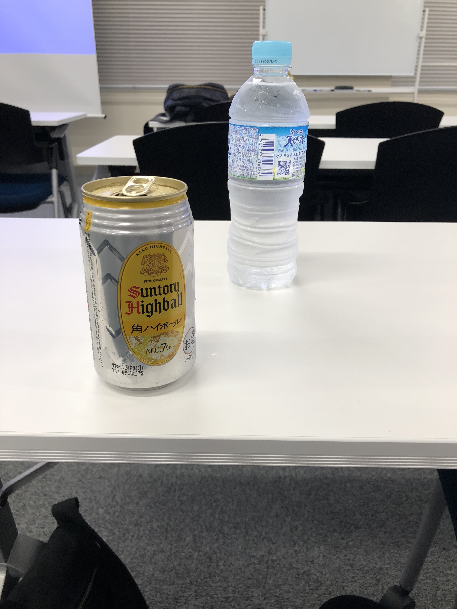
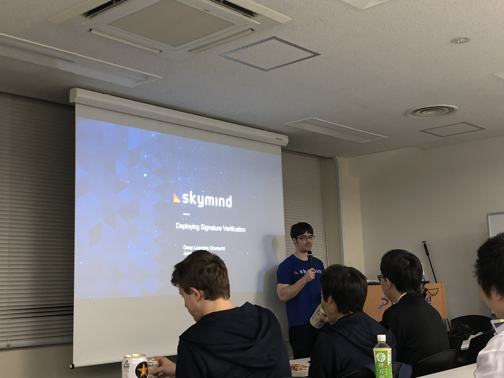
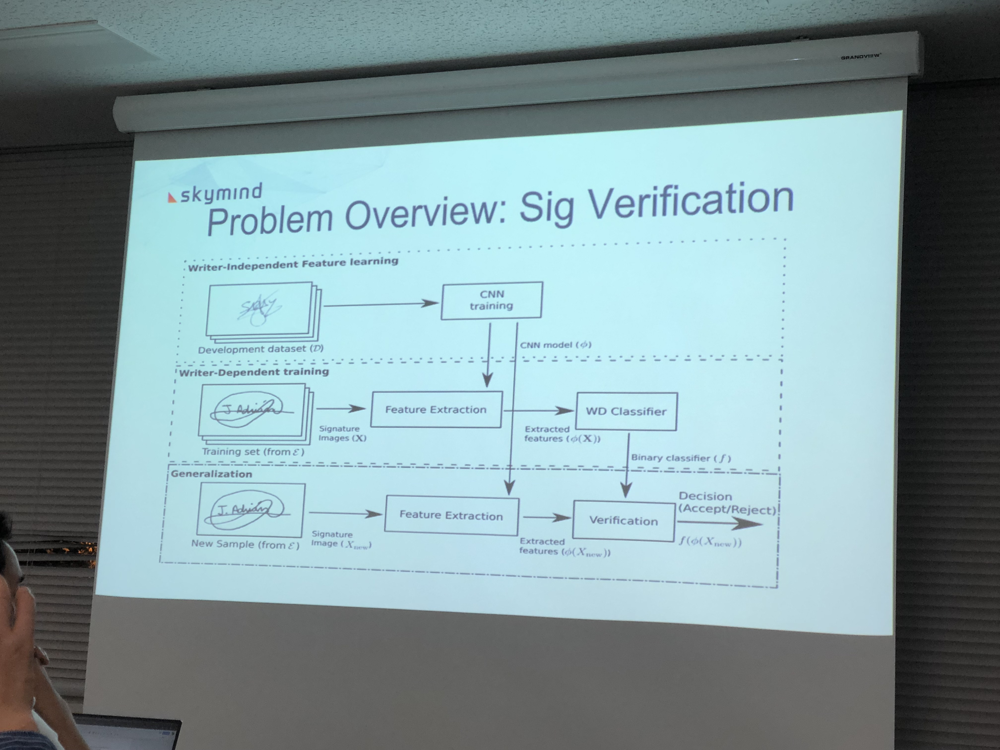

Its been four months since I have been living in Tokyo, currently, I'm working for a Japanese company for some machine learning consultancy. I was very curious about the software development movement here in Tokyo, especially machine learning. Japan is well known worldwide for robotics and hardware innovations, I was wondering if is as good for modern AI. So I start searching for machine learning meetups and I come across a group called Deep learning Otemachi group, so after work, I decided to see and check their talks at the Marunouchi Building near Tokyo station.

The event is actually hosted by a company called Preferred Networks, they have been promoting machine learning talks here in Tokyo.

The event overall was very interesting to me, lots of great projects were discussed by people around the world with they wish to share the results with the community, I was impressed.

Here is the list of the very interesting projects that were discussed, overall I like a lot this talks, they were very technical and the speakers were very open to answering those questions, the most valuable thing I found was how they discuss the deep learning architectures and what challenges they found during the development process.

When you arrive the meetup you can grab as many snacks and Japanese drinks as you like ;), before start listening to some complex deep learning I think my head needed some Japanese whiskey to start catching the ideas better.

Alpaca's pipeline for real-time market forecasting

The first talk was given by Paul and Remy, two French engineers that were very knowledgeable about time series analysis, they explained in great detail  how to use deep learning techniques to predict market behaviors, they talk about how the Alpaca company were successful in real-time market analysis using RNNs for time-sensitive predictions, this core functionality is part of today's Bloomberg's client application for market forecasting.

Interactively Picking Real-World Objects with Unconstrained Spoken Language Instructions
This talk discussed and end-to-end approach for object detection using SSD along with a couple of NLP techniques (see architecture below) attached to a robot arm. The overall system was able to listen to your commands and grab any item from the four squared areas and put the mentioned object on the desired position. This system uses NLP to understand the semantics in your sentence command eg (move the rounded object next to the smartphone), along with an RNN for speech recognition, along with a CNN + SSD for object detection, the system was an end to end solution using multiple stacked layers of neural networks. The result is very cool.

Adam Gibson (Skymind), Deploying millions of models to production for large-scale signature verification using transfer learning + one class neural network

This talk was amazing, Adam explained who he managed to solve the problem of detecting whether or not a hand signature is faked or legit, this problem imposes a lot of problems with the data, usually if you are a bank you have so much data about your users but in this case, you only have 1 or 2 samples per person signature!, so the problem is very unbalanced this requires a different architecture and you cant use big popular datasets like IMAGENET for transfer learning because they dont work so well for black and white images.

This architecture I'm still trying to understand it, I find it so interesting!

